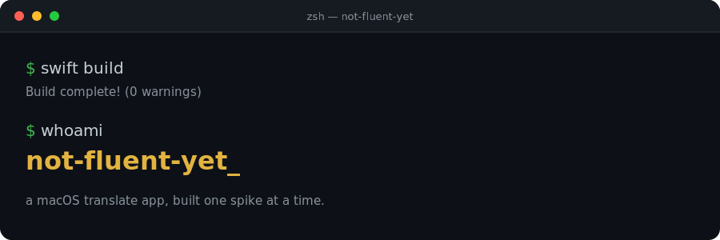

# not-fluent-yet

**Translate what you type or say, anywhere on macOS, without switching apps.**


Press a global hotkey from any app, type or speak, and get a translation back — copied to your clipboard, one keystroke away from pasting wherever you need it. Built on Apple's on-device Translation and Speech frameworks, so it works offline and keeps your text on your Mac.

- ⌨️ **Global hotkey** (`Ctrl+Option+T`) — opens a floating panel without stealing focus from the app you're using
- 🎙️ **Speak instead of typing** — tap the mic, talk, and it translates as soon as you stop
- 🌍 **20 languages** — pick source/target from the menu bar
- 📋 **Clipboard-based** — no special permissions, no Accessibility prompts, works sandboxed
- 🍎 **Native and on-device** — Apple's Translation and Speech frameworks, nothing sent to a third party

## Quick start

```bash
git clone https://github.com/eiffelice/not-fluent-yet.git
cd not-fluent-yet
./scripts/build-app.sh
open dist/Translate.app
```

That's it — the app runs as a menu bar accessory (no Dock icon) until you Quit from its menu.

## Usage

1. Press `Ctrl+Option+T` from any app.
2. A floating panel appears — type, paste, or tap the mic and speak.
3. Press Enter. The panel shows "Translating…", then the result.
4. Press Enter again to copy it to your clipboard — the panel confirms and closes. Paste it with `⌘V` wherever you need it.
5. Escape cancels at any point.

Menu bar menu also gives you:

- **Translate from / Translate to** — pick any language pair
- **Swap direction** — flip the current pair
- **Launch at Login**
- Microphone / Speech Recognition permission status, with one-click links to System Settings

### Supported languages

🇺🇸 English · 🇹🇭 Thai · 🇪🇸 Spanish · 🇫🇷 French · 🇩🇪 German · 🇮🇹 Italian · 🇧🇷 Portuguese · 🇯🇵 Japanese · 🇰🇷 Korean · 🇨🇳 Chinese (Simplified) · 🇷🇺 Russian · 🇸🇦 Arabic · 🇮🇳 Hindi · 🇻🇳 Vietnamese · 🇮🇩 Indonesian · 🇳🇱 Dutch · 🇵🇱 Polish · 🇹🇷 Turkish · 🇺🇦 Ukrainian · 🇲🇾 Malay

Any pair among these can be picked from the menu bar. The list lives in `LanguagePair.supportedLanguages`; speech-to-text locales are mapped 1:1 in `SpeechInputService.localeIdentifier`.

Translation runs fully on-device once a language pack is downloaded (first use of a pair may need one brief download). Speech-to-text currently lets macOS choose on-device vs. server-based recognition automatically.

### Known limitations

- No persisted settings — language pair and hotkey reset to defaults on relaunch.
- No automatic selected-text capture — type, paste, or speak into the panel.

## Requirements

- macOS 15+ Sequoia.
- Xcode 16+ (the `Translation` framework is a macOS 15 SDK API).
- Swift 5.9+.
- No third-party dependencies.

## Mac App Store build — `AppStore/`

The app's logic lives in a library target, `TranslateCore` (see `Package.swift`), shared between the personal build above and a sandboxed Xcode app for App Store submission — same code, no forked logic. SwiftPM alone can't produce an App Store archive, so `AppStore/` is a real `.xcodeproj`, generated from `AppStore/project.yml` via [XcodeGen](https://github.com/yonaskolb/XcodeGen) rather than hand-maintained.

```bash
brew install xcodegen   # one-time
./AppStore/generate.sh
open AppStore/TranslateStore.xcodeproj
```

Then pick your Apple Developer Team under Signing & Capabilities before archiving. This target already has App Sandbox on with exactly the entitlements it needs (`app-sandbox`, `device.audio-input` for the mic, `network.client` for language pack downloads) — no Accessibility entitlement exists because nothing in this app uses it.

Still open before submitting: a polished app icon (the current one is a placeholder), App Store Connect metadata, and a privacy policy URL (required once an app requests microphone/speech access).

## Development

This app was built as three isolated technical spikes before becoming the real thing — each one validates a specific risk in isolation, standalone and independent of the app.

| Spike | Validates |
| --- | --- |
| [`spike1-translation/`](spike1-translation) | Apple Translation framework, headless/offscreen usage |
| [`spike2-pasteback/`](spike2-pasteback) | Clipboard-safe auto-paste via `CGEvent` (not used by the real app — see below) |
| [`spike3-panel/`](spike3-panel) | Non-activating floating panel with a global hotkey |

<details>
<summary><strong>Spike 1 — Apple Translation framework, headless/offscreen usage</strong></summary>

Goal: prove that code outside a visible translation UI can call translation through a hidden SwiftUI host view that owns `.translationTask`.

Run:

```bash
swift run spike1-translation
swift run spike1-translation --from th --to en
swift run spike1-translation --debug-window
```

Expected output shape:

```text
SPIKE 1: Apple Translation framework headless/offscreen usage
INFO: Source language: th
INFO: Target language: en
INFO: Test input: สวัสดีครับ วันนี้อากาศดีมาก
INFO: Language pair status: installed.
INFO: Calling prepareTranslation()...
INFO: Calling session.translate(_:)...
RESULT: Hello, today the weather is very nice.
PASS: Translation returned a non-empty English-looking string.
```

Known failure modes:

- `FAIL: macOS 15+ is required...` — run on macOS 15 or newer.
- `Unsupported translation pair` — the source/target pair is not supported by Apple Translation.
- `prepareTranslation() failed` — the system language-pack download prompt was cancelled or could not be shown.
- The hidden window is intentionally offscreen and almost transparent. If the language-pack prompt does not appear, try `--debug-window` once to make the host window slightly visible while testing.

Notes:

- The test input is `สวัสดีครับ วันนี้อากาศดีมาก` from Thai to English.
- The spike calls `LanguageAvailability.status(from:to:)` first and handles availability-check errors on newer SDKs where this API is `async throws`.
- If status is `supported` but not `installed`, the spike calls `prepareTranslation()` before translating so macOS can prompt for language asset download.

</details>

<details>
<summary><strong>Spike 2 — Clipboard-safe paste-back into the frontmost app</strong></summary>

Goal: prove that translated text can be pasted into the app that was frontmost before the translation panel appeared, while preserving the user's existing clipboard.

**The real app does not use this technique** — see "Why not auto-paste" below. This spike stands on its own as a validated but unused approach.

Accessibility permission is required because this spike posts synthetic keyboard events. Grant it in System Settings > Privacy & Security > Accessibility. If you run with `swift run` from Terminal, grant Accessibility to Terminal, iTerm, or whatever shell host launches the process.

Run:

```bash
swift run spike2-pasteback
swift run spike2-pasteback --paste-delay-ms 300
swift run spike2-pasteback --capture-delay-ms 2000 --paste-delay-ms 300
```

CLI testing procedure with TextEdit:

1. Open TextEdit and create a new document, cursor in the document.
2. Run `swift run spike2-pasteback --capture-delay-ms 2000 --paste-delay-ms 300`.
3. Immediately click back into TextEdit before the 2-second capture delay ends.
4. Verify `HELLO_FROM_SPIKE2` appears in TextEdit, and your old clipboard is restored afterward.

Why `--capture-delay-ms` exists: when launched from Terminal, Terminal is normally the frontmost app at process start. The delay makes manual CLI testing possible by letting you focus TextEdit before the spike captures `NSWorkspace.shared.frontmostApplication`.

Expected output shape:

```text
SPIKE 2: Clipboard-safe paste-back into the frontmost app
INFO: Captured frontmost app before paste: TextEdit [pid=123]
INFO: Saved pasteboard items: 1, total types: 3
INFO: Wrote test string to pasteboard.
INFO: Requested re-activation of previous app: accepted
INFO: Posted Cmd+V via CGEvent to the HID event tap.
INFO: Restored original pasteboard contents after 300 ms. Verified: yes
PASS: Paste event was posted and the original pasteboard contents were restored. Manually verify "HELLO_FROM_SPIKE2" appeared in TextEdit.
```

Known failure modes:

- `Accessibility permission is not granted` — grant permission and re-run.
- Text appears in Terminal instead of TextEdit — use `--capture-delay-ms` and focus TextEdit before capture.
- No paste happens — increase `--paste-delay-ms` to `500` or `800` because focus restoration can race with the paste event.
- Clipboard not restored — this should be rare; the spike restores the saved pasteboard snapshot on both success and error paths.

Implementation details:

- Saves all current `NSPasteboardItem` objects and their available types/data.
- Writes `HELLO_FROM_SPIKE2` as `.string`.
- Re-activates the captured frontmost app with `NSRunningApplication.activate(options:)`.
- Posts Cmd+V using `CGEvent` to `.cghidEventTap`.
- Restores the original pasteboard after the configurable delay.

</details>

<details>
<summary><strong>Spike 3 — Non-activating floating input panel</strong></summary>

Goal: prove that a floating input panel can accept typing without changing the frontmost app.

Run:

```bash
swift run spike3-panel
swift run spike3-panel --hotkey ctrl+option+y
swift run spike3-panel --hotkey cmd+shift+t
```

Default hotkey: `Ctrl+Option+T`.

Test procedure:

1. Open any app (Safari, TextEdit, Finder, or a fullscreen app) and keep it focused.
2. Press `Ctrl+Option+T`. A floating panel should appear centered on the active screen.
3. Type any text into the panel, then press Escape.
4. Confirm the console prints PASS, the previous app is still frontmost, and the spike exits after the first PASS/FAIL.

Expected output shape:

```text
SPIKE 3: Non-activating floating input panel
INFO: Hotkey: ctrl+option+t
INFO: Global hotkey registered. Keep another app focused, then press ctrl+option+t.
INFO: Frontmost before showing panel: TextEdit [pid=123]
INFO: Frontmost while panel is visible: TextEdit [pid=123]
INFO: Frontmost after hiding panel: TextEdit [pid=123]
INFO: Typed text captured by panel: yes
PASS: Previous app still has focus and the non-activating panel accepted keyboard input.
```

The spike terminates after this first PASS/FAIL result so it behaves like a standalone validation program rather than a long-running app.

Known failure modes:

- Hotkey does nothing — another app may own the hotkey. Try `--hotkey ctrl+option+y`.
- Panel appears but typing goes to the old app — non-activating panel key behavior failed; this is exactly what this spike is meant to validate on your target macOS/hardware.
- Panel does not appear over fullscreen app — check that `collectionBehavior` includes `.fullScreenAuxiliary` and test with a different fullscreen app/Space.
- Focus changes to the spike process — the non-activating panel behavior failed or a later UI change accidentally activated the app.

Implementation details:

- Uses `NSPanel` with `styleMask: [.nonactivatingPanel, .titled]`.
- Uses `level = .floating`.
- Uses `collectionBehavior = [.canJoinAllSpaces, .fullScreenAuxiliary]`.
- Registers a global hotkey with Carbon `RegisterEventHotKey`.
- Logs the frontmost app before showing and after hiding.
- Prints PASS only when typed text was captured and the frontmost app process matches.

</details>

### Why not auto-paste?

Spike 2 proved that a `CGEvent`-simulated Cmd+V can paste into the previously-frontmost app automatically. The real app doesn't use that technique: it requires the Accessibility permission, which resets on every rebuild for an ad-hoc-signed dev binary (no paid Apple Developer certificate), and it's fundamentally incompatible with the Mac App Store's App Sandbox requirement — sandboxed apps cannot post synthetic input into other processes. Copying to the clipboard needs no special permission at all, works identically whether sandboxed or not, and is one keystroke away from the old behavior.

### Suggested spike validation order

1. Spike 3 first, to confirm the panel can accept typing without focus theft.
2. Spike 1 next, since the Translation framework may require language assets to download.
3. Spike 2 only if you specifically want to validate the CGEvent auto-paste technique — the real app no longer uses it.

### Build everything

```bash
swift build                              # all targets
swift build --product spike1-translation
swift build --product spike2-pasteback
swift build --product spike3-panel
```

You can also open the folder in Xcode as a Swift Package.

## License

All rights reserved.
